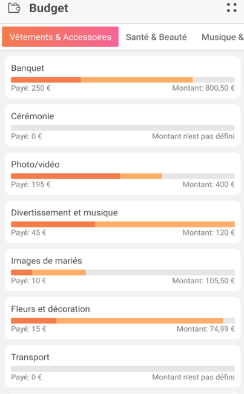
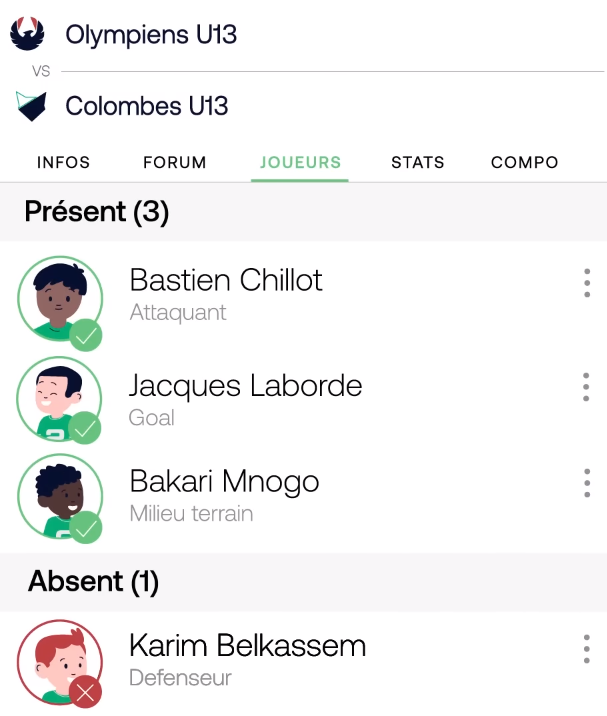
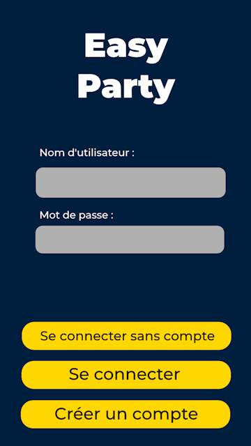
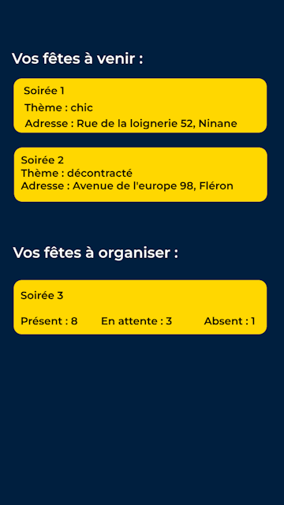
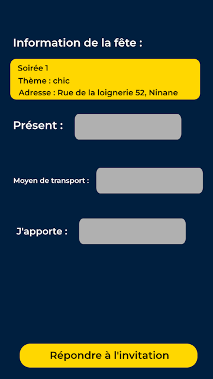
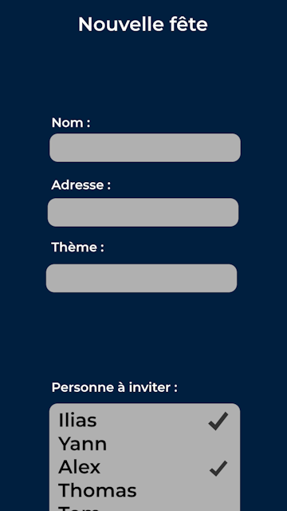
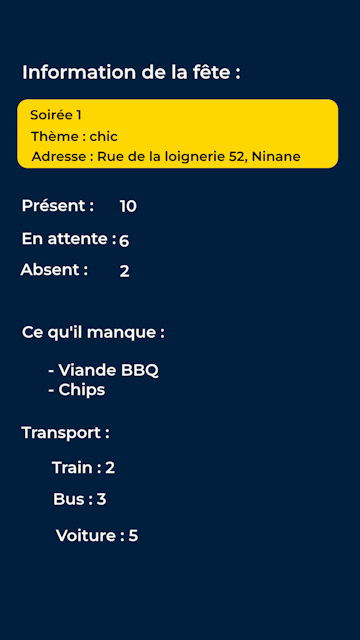
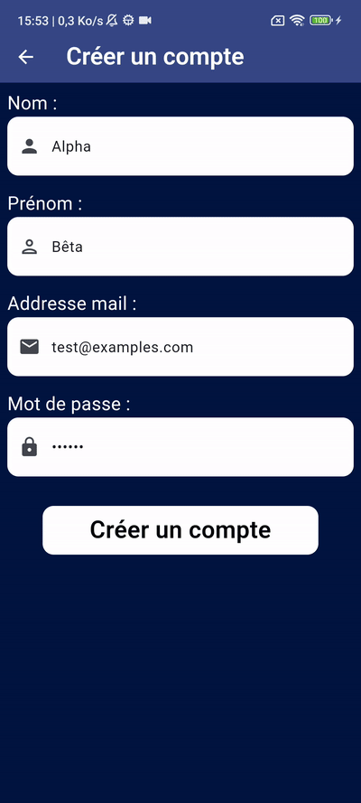
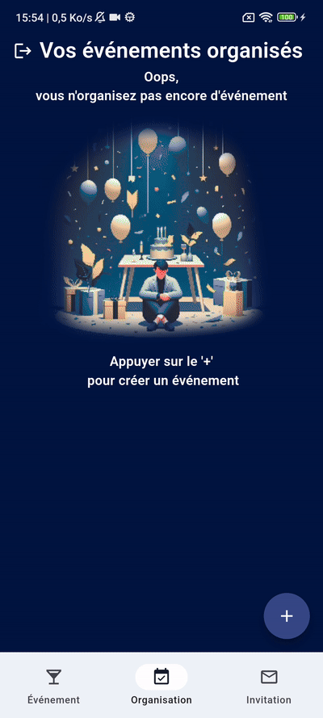

# Easy Party

Ce projet a été réalisé dans le cadre d'une initiative académique visant à approfondir mes connaissances en programmation et à mettre en pratique les concepts étudiés.

## 🚀 Présentation de l'Application

L'application que nous développons est une plateforme conviviale qui vise à simplifier l'organisation de fêtes et d'événements entre amis. Elle permet à l'organisateur de créer un événement, d'inviter des participants et de gérer les détails logistiques de manière efficace. L'objectif est de faciliter la coordination, que toute les informations sont regroupé au même endroit et de rendre l'expérience de la planification d'événements plus agréable.

## 📁 Présentation des Principaux Dossiers

~~~text
Easy-Party/
│
├── code/
│   ├── dto/ 
│	├── easy_party/ -- ici le projet Flutter ! 
│	└── push_data_to_firebase/
│
├── maquettes/
│   ├── welcome.png
│   ├── home.png
│   ├── ...
│   
├── img/
│   ├── ...
│   └── ...
│
├── LICENSE
├── Énoncé.pdf
└── readme.md
~~~

- Le dossier `code` contient le code source de l'application.
- Dans le dossier `maquettes` se trouvent les premières maquettes/idées de l'applications
- Le dossier `img` contient des images pour le repositorie
- Le fichier LICENSE à la racine du dépôt indique les termes et conditions de la licence sous laquelle le code source est distribué. Le fichier README que vous êtes entrain de lire se trouve aussi dans la racine

## 🌐 Étude de l'Existant

### Planificateur d'événements

Le Planificateur d'événements est une application axée sur l'organisation de mariages, offrant des fonctionnalités spécifiques pour la coordination de cet événement particulier. Il se concentre sur des aspects tels que la gestion des invités, la réservation de lieux spéciaux, et la planification détaillée nécessaire pour les mariages. Bien que cette application puisse être utile pour des événements plus formels, elle peut manquer de la simplicité nécessaire pour les rassemblements informels entre amis.

| Points forts        | Points faibles                   |
| ------------------- | -------------------------------- |
| Plus complet        | Plus difficile à prendre en main |
| Plus de possibilité | Utile que pour l'organisateur    |

### SportEasy

SportEasy se concentre sur la gestion d'équipes sportives et offre des fonctionnalités telles que la planification des entraînements, la gestion des présences et le suivi des performances sportives. Bien qu'elle offre des capacités de planification, elle est plus orientée vers les activités sportives organisées, ce qui peut ne pas correspondre aux besoins des utilisateurs cherchant à organiser des fêtes informelles ou des sorties entre amis.

## 🎯 Public Cible

Notre application s'adresse principalement aux groupes d'amis, aux familles et aux collègues qui cherchent à organiser des événements informels. Elle convient à toutes les tranches d'âge, mais elle cible particulièrement les personnes actives socialement et à la recherche d'une solution pratique pour planifier des sorties et des rencontres avec leurs amis. Les utilisateurs de smartphones sont notre public cible, car l'application est conçue pour une utilisation mobile conviviale.

## 📋 Fonctionnalités

### 1. Création d'événements
- Les utilisateurs peuvent créer des événements en spécifiant le nom, la date, l'heure et l'emplacement de la fête.
- Ils peuvent ajouter une description pour donner plus de détails sur l'événement.

### 2. Invitation d'amis
- Les organisateurs peuvent inviter des amis en saisissant leur nom d'utilisateur unique.
- Les invitations sont envoyées par le biais de notifications.

### 3. Confirmation de participation
- Les invités peuvent indiquer s'ils participent ou non à l'événement.
- Ils peuvent également spécifier s'ils apportent de la nourriture, des boissons ou d'autres éléments.

### 4. Planification du transport
- Les participants peuvent indiquer comment ils se rendront à l'événement, que ce soit en covoiturage, à pied, en vélo, en transports en commun, etc.
- Les informations de transport sont regroupées pour faciliter l'organisation des transports.

## ✏️ Maquettes

## 📈 État d'Avancement

- [x] Gérer l’identification ainsi que l’authentification de votre utilisateur.
- [x] Les utilisateurs peuvent créer des événements en spécifiant le nom, la date, l'heure et l'emplacement de la fête.
- [x] Les organisateurs peuvent inviter des amis en saisissant leur adresse mail.
- [x] Les organisateurs peuvent modifier les informations sur leur événement
- [x] Les invités peuvent indiquer s'ils participent ou non à l'événement.
- [x] Les invités peuvent spécifier s'ils apportent de la nourriture, des boissons ou d'autres éléments.
- [ ] Les invitations sont envoyées par le biais de notifications.
- [ ] Les participants peuvent indiquer comment ils se rendront à l'événement, que ce soit en covoiturage, à pied, en vélo, en transports en commun, etc.
- [ ] Les informations de transport sont regroupées pour faciliter l'organisation des transports.

## 🎥 Démonstration

### Création d'un compte

### Création d'un événement

### Démonstration global de l'application

## ⚙️ Compilation de l'Application

1. Cloner le projet `git clone https://github.com/trans-dam-2023-2024/projet-d-examen-2324-farine_paquet.git` pour HTTPS ou `git@github.com:trans-dam-2023-2024/projet-d-examen-2324-farine_paquet.git` pour SSH

2. Créer un projet dans [Firebase](https://firebase.google.com/) et si vous n'avez jamais fais de projet Firebase avec Flutter, suivez les étapes d'intégration de Firebase dans Flutter

3. Activer Authentification avec Adresse e-mail et Mot de passe

4. Activer Cloud Firestore (attention de donner l'accès nécessaire aux utilisateurs)

5. Aller dans le répertoire du projet Flutter `cd projet-d-examen-2324-farine_paquet/code/easy_party/`

6. Exécuter la commande `flutterfire configure --project=nom-du-projet-firebase` et sélectionner **IOS** et **Android**

7. Ouvrir le projet **push_data_to_firebase** dans Android Studio, activer le support Dart, faire un **Pub get** et mettre dans le `main.dart` l'id de votre projet dans le String `pi` et la clé API Web dans le String `apiKey` 

8. Créer une configuration de **Dart Command Line App** sur le fichier main.dart puis éxecuter le

9. Ouvrir le projet **easy_party** dans Android Studio, faire un **Pub get**

10. Vous pouvez maintenant compiler l'application !
